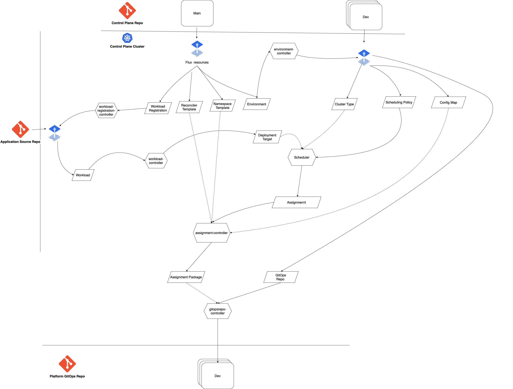

# Kalypso Scheduler
[](https://github.com/microsoft/kalypso-scheduler/actions/workflows/ci.yaml)

[Kalypso](https://github.com/microsoft/kalypso) scheduler operator, responsible for scheduling applications and services on cluster types and uploading the result to the GitOps repo.

## Kalypso Control Plane Abstractions

Kalypso Scheduler operates with high level abstractions that the Platform Team uses to describe clusters in their environments. These abstractions are objects on the control plane Kubernetes cluster. The scheduler watches the abstractions and reconciles them by performing necessary transformations and scheduling, generating low level manifests and uploading them to the GitOps repositories. The GitOps operators on the workload clusters fetch assigned workloads and configurations from those GitOps repositories.

The control plane abstractions are human oriented yamls, that the Platform Team can easily manipulate and version control in a [Control Plane](https://github.com/microsoft/kalypso-control-plane) repository. It is common to deliver the abstractions to the control plane Kubernetes cluster with a GitOps operator, such as [Flux CD](https://fluxcd.io).

### Cluster Type

Cluster type defines a set of K8s clusters with similar properties that host the same collection of workloads and share the same platform configuration values. A single cluster type may be backed up by thousands of physical clusters.  

#### Example

```yaml
apiVersion: scheduler.kalypso.io/v1alpha1
kind: ClusterType
metadata:
  name: large
  labels: 
    region: west-us
    size: large
spec:
  reconciler: argocd
  namespaceService: default
```

The example above defines `large` cluster type that uses `argocd` as a [reconciler](#reconciler-template). It provides a namespace for each assigned workload, generated from the `default` [namespace template](#namespace-template). 

### Reconciler template

Each cluster type may use their own reconciler, for example Flux, ArgoCD, Rancher Fleet, polling script etc. This abstraction contains [Go manifest template](https://pkg.go.dev/text/template#hdr-Text_and_spaces), which is used to generate reconciler deployment descriptors.  

#### Example

ArgoCD application

```yaml
apiVersion: scheduler.kalypso.io/v1alpha1
kind: Template
metadata:
  name: argocd
spec:
  type: reconciler
  manifests:
    - apiVersion: argoproj.io/v1alpha1
      kind: Application
      metadata:
        name: "{{ .DeploymentTargetName}}"
        namespace: argocd
      spec:
          destination:
              server: https://kubernetes.default.svc
              namespace: "{{ .Namespace}}"
          project: default
          source:
              path: "{{ .Path}}"
              repoURL: "{{ .Repo}}"
              targetRevision: "{{ .Branch}}"
              directory:
                  recurse: true
                  include: '*.yaml'
                  exclude: 'kustomization.yaml'
          syncPolicy:
              automated:
                  prune: true
                  selfHeal: true
                  allowEmpty: false
              syncOptions:
              - CreateNamespace=true
```

Flux resources

```yaml
apiVersion: scheduler.kalypso.io/v1alpha1
kind: Template
metadata:
  name: arc-flux
spec:
  type: reconciler
  manifests:
    - apiVersion: source.toolkit.fluxcd.io/v1beta2
      kind: GitRepository
      metadata:
        name: "{{ .DeploymentTargetName}}"
        namespace: flux-system
      spec:
        interval: 1m0s
        url: "{{ .Repo}}"
        ref:
          branch: "{{ .Branch}}"
    - apiVersion: kustomize.toolkit.fluxcd.io/v1beta2
      kind: Kustomization
      metadata:
        name: "{{ .DeploymentTargetName}}"
        namespace: flux-system
      spec:
        interval: 1m0s
        targetNamespace: "{{ .Namespace}}"
        sourceRef:
          kind: GitRepository
          name: "{{ .DeploymentTargetName}}"
        path: "{{ .Path}}" 
        prune: true
```

The templates above are used to generate ArgoCD and Flux resources respectively. Reconcilers on the clusters use them to fetch manifests from the workload manifest storages, defined in the [deployment targets](#workload). 

### Namespace template

Each workload on every cluster has a dedicated namespace. This abstraction defines a manifest template for this namespace. 

#### Example

```yaml
apiVersion: scheduler.kalypso.io/v1alpha1
kind: Template
metadata:
  name: default
spec:
  type: namespace
  manifests:
    - apiVersion: v1
      kind: Namespace
      metadata:
        name: "{{ .Namespace}}" 
        labels:
          environment: "{{ .Environment}}"
          workspace: "{{ .Workspace}}"
          workload: "{{ .Workload}}"
          deploymentTarget: "{{ .DeploymentTargetName}}"
          someLabel: some-value
```

Besides just a namespace, the template may include some common resources that should be created for every workload, like RBAC configurations and such.

<!-- TODO
Describe available values to be used in the templates
-->

### Workload registration

Workload registration is a reference to a git repository where the [workload](#workload) is defined. The scheduler creates Flux resources on the control plane cluster to fetch the [workload](#workload) definition.

#### Example

```yaml
apiVersion: scheduler.kalypso.io/v1alpha1
kind: WorkloadRegistration
metadata:
  name: hello-world-app
  labels:
    type: application
spec:
  workload:
    repo: https://github.com/microsoft/kalypso-app-src
    branch: main
    path: workload/
  workspace: kaizen-app-team
```

The example above defines a workload registration that points to a place in a git repository where a yaml file with the workload definition is stored. 

### Workload

Workload describes where an application or a service should be deployed from the perspective of an application team. It contains a list of deployment targets. Each deployment target defines a name, a reference to a rollout environment, a custom set of labels and a reference to a storage with the manifests, specific for this deployment target. 

#### Example

```yaml
apiVersion: scheduler.kalypso.io/v1alpha1
kind: Workload
metadata:
  name: hello-world-app
  labels:
    type: application
    family: force
spec:
  deploymentTargets:
    - name: functional-test
      labels:
        purpose: functional-test
        edge: "true"
      environment: dev
      manifests:
        repo: https://github.com/microsoft/kalypso-app-gitops
        branch: dev
        path: ./functional-test
    - name: performance-test
      labels:
        purpose: performance-test
        edge: "false"
      environment: dev
      manifests:
        repo: https://github.com/microsoft/kalypso-app-gitops
        branch: dev
        path: ./performance-test
    - name: uat-test
      labels:
        purpose: uat-test
      environment: stage
      manifests:
        repo: https://github.com/microsoft/kalypso-app-gitops
        branch: stage
        path: ./uat-test
```

The example above defines that `hello-world-app` application is supposed to be deployed to three targets. It should be deployed in `Dev` environment for functional and performance testing and in `Stage` environment for UAT testing. Each deployment target is marked with custom labels and points to the folders in [Application GitOps](https://github.com/microsoft/kalypso-app-gitops) repository where the Application Team generates application manifests for each target.

### Scheduling policy

The scheduler uses scheduling policies to map or schedule [deployment targets](#workload) to the [cluster types](#cluster-type). Currently, the algorithm is based on the simple label matching approach. Next version of the scheduler will provide integration with [OCM Placement API](https://open-cluster-management.io/concepts/placement/) for the more sophisticated and custom scheduling implementations.

#### Example

```yaml
apiVersion: scheduler.kalypso.io/v1alpha1
kind: SchedulingPolicy
metadata:
  name: functional-test-policy
spec:
  deploymentTargetSelector:
    workspace: kaizen-app-team
    labelSelector:
      matchLabels:
        purpose: functional-test
        edge: "true"
  clusterTypeSelector:
    labelSelector:
      matchLabels:
        restricted: "true"
        edge: "true"
```

The example above specifies that all deployment targets from the `kaizen-app-team` workspace, marked with labels `purpose: functional-test` and `edge: "true"` should be scheduled on all cluster types that are marked with label `restricted: "true"`.

### Config

Platform configuration values are defined with the standard Kubernetes config maps, marked with custom labels. The scheduler scans all config maps with the label `platform-config: "true"` in the namespace and collects values for each cluster type basing on the label matching. Every workload on each cluster will have a `platform-config` config map in its namespace with all platform configuration values, that the workload can use on this cluster type in this environment.

#### Example

```yaml
kind: ConfigMap
metadata:
  name: west-us-config
  labels:
     platform-config: "true"
     region: west-us
data:
  REGION: West US
  DATABASE_URL: mysql://west-stage:8806/mysql
```

The example above defines a config map specifying some values for all cluster types with the label `region: west-us`.

### Environment

Environment defines a rollout environment such as `dev`, `stage`, `prod`. It defines a place in a git repository where the control plane abstractions for this environment are stored. The scheduler creates a namespace for each environment on the control plane cluster and creates Flux resources to fetch the abstractions from the defined place.

#### Example

```yaml
apiVersion: scheduler.kalypso.io/v1alpha1
kind: Environment
metadata:
  labels:
  name: dev
spec:
  controlPlane:
    repo: https://github.com/microsoft/kalypso-control-plane
    branch: dev
    path: .
```

<!--
### Base repository

Control plane abstractions such as [workload registrations](#workload-registration), [templates](#reconciler-template) or some config maps are common for all environments and are stored in a common place like [main](https://github.com/microsoft/kalypso-control-plane) branch of a control plane repository. To fetch those common abstractions to the environment namespaces on the control plane cluster,     
-->

### GitOps repository 

The result of the scheduling and transformation is about to be uploaded to one or many GitOps repositories. This is the output of the scheduler. The reconcilers on the clusters can fetch their manifests from the GitOps repositories, being abstracted away from the details of how those manifests where generated and how the scheduling has happened.  

The scheduler uses the GitOps repository abstraction as a reference to where it should PR the generated manifests.   

#### Example

```yaml
apiVersion: scheduler.kalypso.io/v1alpha1
kind: GitOpsRepo
metadata:
  name: dev
spec:
  repo: https://github.com/microsoft/kalypso-gitops
  branch: dev
  path: .
```

## Transformation Flow

The primary goal of the Kalypso Scheduler is to transform high level control plane abstractions into the low level Kubernetes manifests that the reconcilers on the clusters can understand. The high level transformation flow is shown on the following diagram:



The common abstractions such as Workload Registrations, Templates and Environments are delivered to the control plane cluster by Flux from the control plane repository. The Environment Controller watches Environments and creates a namespace for each environment in the control plane cluster. It creates corresponding Flux resources to deliver environment specific abstractions such as Cluster Types, Scheduling Policies, Config Maps and GitOps Repos from the environment branches to the environment namespace in the control plane cluster. 

The Workload Registration Controller creates Flux resources to fetch Workloads from the Application repositories specified in the Workload Registrations. The Workload Controller watches Workloads, delivered by Flux, and unfolds them into Deployment Targets. 

The Scheduler watches Scheduling Policies, Cluster Types, Deployment Targets and assigns Deployment Targets to Cluster Types. It creates an Assignment object for each Deployment Target assignment. The Assignment Controller uses Reconciler and Namespace templates, referenced by the assigned cluster type, and generates reconciler and namespace manifests. It also scans Config Maps in the environment namespaces that are applicable to this cluster type basing on label matching. It generates a consolidated Config Map and adds it to the Assignment Package along with the reconciler and namespace manifests.

The GitOps Repo Controller watches Assignment Packages and creates a PR with their content to the GitOps repository specified in this environment.   

## Installation

### Prerequisites 
Kalypso Scheduler requires Flux to be installed on the control plane cluster. 


Add Kalypso Scheduler Helm repository:
```sh
helm repo add kalypso https://raw.githubusercontent.com/microsoft/kalypso-scheduler/gh-pages/
```

Create a namespace and install the Helm chart:
```sh
kubectl create ns kalypso 
helm upgrade -i kalypso kalypso/kalypso-scheduler -n kalypso --set controlPlaneURL=<Control Plane GitHub Repo URL> \
--set controlPlaneBranch=main --set ghRepoToken=<GitHub Repo Token>
```

## Contributing

This project welcomes contributions and suggestions.  Most contributions require you to agree to a
Contributor License Agreement (CLA) declaring that you have the right to, and actually do, grant us
the rights to use your contribution. For details, visit https://cla.opensource.microsoft.com.

When you submit a pull request, a CLA bot will automatically determine whether you need to provide
a CLA and decorate the PR appropriately (e.g., status check, comment). Simply follow the instructions
provided by the bot. You will only need to do this once across all repos using our CLA.

This project has adopted the [Microsoft Open Source Code of Conduct](https://opensource.microsoft.com/codeofconduct/).
For more information see the [Code of Conduct FAQ](https://opensource.microsoft.com/codeofconduct/faq/) or
contact [opencode@microsoft.com](mailto:opencode@microsoft.com) with any additional questions or comments.

## Trademarks

This project may contain trademarks or logos for projects, products, or services. Authorized use of Microsoft 
trademarks or logos is subject to and must follow 
[Microsoft's Trademark & Brand Guidelines](https://www.microsoft.com/en-us/legal/intellectualproperty/trademarks/usage/general).
Use of Microsoft trademarks or logos in modified versions of this project must not cause confusion or imply Microsoft sponsorship.
Any use of third-party trademarks or logos are subject to those third-party's policies.
